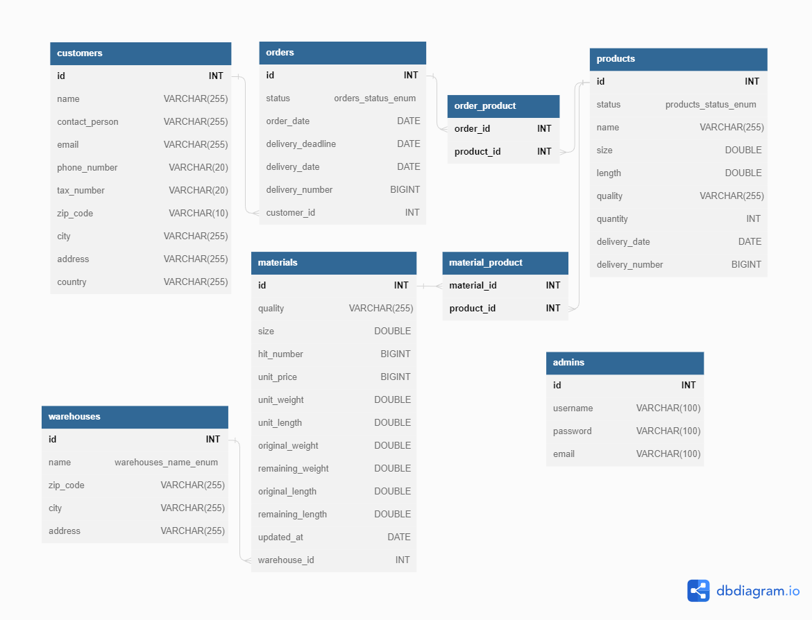

# Csavarokat és anyákat gyártó vállalkozás

## Entitás-kapcsolati diagram

## Alkalmazott technológiák
* Java
* Lombok
* Spring Boot
* Spring Data JPA
* Spring Security
* H2
* Flyway
* MySQL
* Docker
* Swagger

|        |Building time   ||Building cost       ||HP     |Effect                                                         |
|--------|-------|---------|--------|------------|-------|---------------------------------------------------------------|
|        |Level 1|Level n  |Level 1 |Level n     |Level n|Level n                                                        |
|Townhall|2:00   |n * 1:00 |200 gold|n * 200 gold|n * 200|can build level n buildings                                    |
|Farm    |1:00   |n * 1:00 |100 gold|n * 100 gold|n * 100|+(n * 5) + 5 food / minute                                     |
|Mine    |1:00   |n * 1:00 |100 gold|n * 100 gold|n * 100|+(n * 5) + 5 gold / minute                                     |
|Academy |1:30   |n * 1:00 |150 gold|n * 100 gold|n * 150|can build level n troops                                       |
|Troop   |0:30   |n * 0:30 |25 gold |n * 25 gold |n * 20 |-(n * 5) food / minute +(n * 10) attack +(n * 5) defense |

## Szükséges technológiák
* Docker
* MySQL

## Futtatás
* .env és .env.docker fájlok beállítása a gyökérkönyvtárban
* Adatbázis létrehozása a MySQL-ben
* A `docker compose up` parancsot futtatása a terminálban.
* Kéréseket küldése az API specifikációnak megfelelően

## Link
* [API Spec](http://localhost:8080/swagger-ui/index.html)
